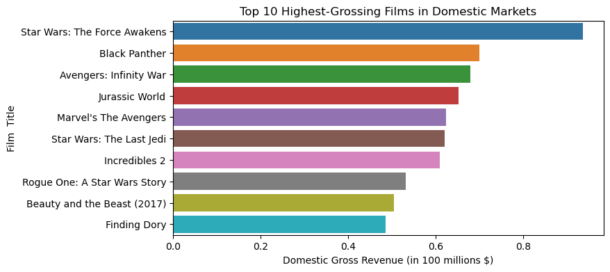
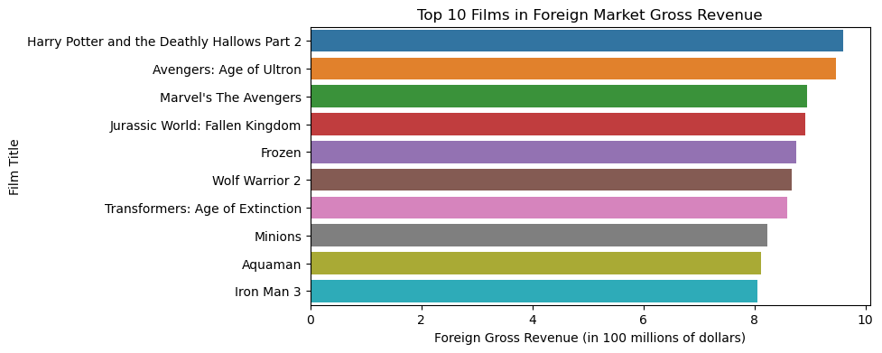
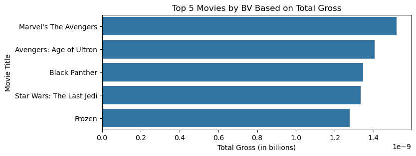

Overview

In its quest to broaden its reach within the entertainment sector, Microsoft, a distinguished leader in technology, is considering an entry into the realm of movie production. This project synopsis presents the company's strategic plan to develop unique cinematic works, utilizing its extensive assets, technological acumen, and well-established brand reputation. The aim is to craft groundbreaking and engaging cinematic pieces that enchant audiences worldwide.

Business Understanding

Microsoft has noted the current corporate movement towards investing in original video content and is keen on participating in this growing field. The corporation is contemplating the creation of a new film studio, while recognizing its inexperience in the cinematic domain. To mitigate this, the project undertakes an extensive Exploratory Data Analysis of the highest-grossing movies currently leading at the box office. The goal is to distill this data into practical insights that will inform the strategic planning for Microsoft's prospective movie studio.

Stakeholder and key business questions

The targeted audience is Microsoft Strategic Management Team that will oversee the  running of the new movie studio.

Data Understanding and Analysis
The project utilizes one dataset, the bom.movie_gross.csv.

Source of data
The ssource of the data is from thenumbers.com website.

Description of data
The dataset contains  Title of the movie,  Studio where the movie was produced, domestic gross earnings, foreign gross earnings and the year the movie was released. 

 Visualizations 
  1. THis bargraph shows the highest top 10 films in  domestic gross revenue.
 
  
  2. THis bargraph shows the highest top 10 films in  foreign gross revenue.
  
  

  3. This graph shows the top 5 movies produced with the leading studio , Buena Vista according to total gross earnings.

Findings

1. There is great domestic appeal for science, fantasy and fiction films.
2. The global market has a massive appeal on franchise blockbuster films like Avengers.
3. Buena Vista records the highest top total gross revenue, where
top 5 high revenue films include franchise blockbuster hits and 
family animated movies.

Conclusions

Microsoft should prioritize create films in science, fantasy and fiction films for the domestic market. For the foreign market, it
should prioritize  franchise blockbusters. Finally, its marketing
strategy should include large scale production of fanchise blockbuster
movies that have a massive fan base and production of family animated
movies that resonate with all age groups.

